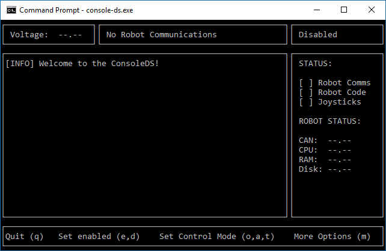

# LibDS C

> **Warning:** This project will be subject to many changes (and complete rewrites) as I learn new things about C.

> If you are interested in learning how the Driver Station works, check the [original LibDS](https://github.com/frc-utilities/libds). It contains everything needed to operate FRC 2014 and 2015/2016 robots.

This is a re-implementation of LibDS in plain C (with SDS for dynamic string handling). For the moment, this code is not really useful, since I doing this just because I want to learn to use C (as I will probably use it a lot in the following years). 

You may find a lot of mistakes here, be it design choices or just dumb mistakes. If you spot something, I would be very grateful if you could tell me about it (or make a pull request).

### Example Project

I have made a simple command-line Driver Station with SDL and ncurses/pdcurses to demostrate the uses of LibDS. You can check it [here](example/).

### Project Architecture

My current idea is to design LibDS in a similar way that [SDL](http://libsdl.org) is designed. Whilst re-using some of the organization of the [original LibDS](https://github.com/frc-utilities/libds).

#### 'Private' vs. 'Public' members

- All the functions that a client application would be interested in are located in [`DS_Client.h`](https://github.com/FRC-Utilities/LibDS-C/blob/master/include/DS_Client.h). 

- Functions that are used by the protocols to update the state of the LibDS are made available in [`DS_Config.h`](https://github.com/FRC-Utilities/LibDS-C/blob/master/include/DS_Config.h). Calling any of the 'setter' functions in [`DS_Config`](https://github.com/FRC-Utilities/LibDS-C/blob/master/include/DS_Config.h) will trigger an event (which can later be used by the client application).

#### Event system

For the moment, I am designing an event system that is very similar to SDL's event system. You can check [`DS_Events.h`](https://github.com/FRC-Utilities/LibDS-C/blob/master/include/DS_Events.h) for current state.

Current State:

- [ ] Register signals when an event has occurred
- [x] Implement the event loop ([code](https://github.com/FRC-Utilities/LibDS-C/blob/master/src/events.c#L257)

#### Protocols

Protocols are encapsulated structures. When a protocol is initialized, it defines its properties and its respective data functions. The different functions of the LibDS will then operate with the data and properties defined by the current protocol.

As with the original LibDS, protocols have access to the `DS_Config` to update the state of the LibDS.

The base protocol is implemented in the [`DS_Protocol`](https://github.com/FRC-Utilities/LibDS-C/blob/master/include/DS_Objects.h#L42) structure.

##### Sockets

Instead of manually initializing a socket for each target, data direction and protocol type (UDP and TCP). The LibDS will use the [`DS_Socket`](https://github.com/FRC-Utilities/LibDS-C/blob/master/include/DS_Objects.h#L34) object to define ports, protocol type and remote targets. 

I will write all the logic code in [`socket.c`](https://github.com/FRC-Utilities/LibDS-C/blob/master/src/socket.c), which will be in charge of managing the system sockets with the information given by a [`DS_Socket`](https://github.com/FRC-Utilities/LibDS-C/blob/master/include/DS_Objects.h#L34) object.
